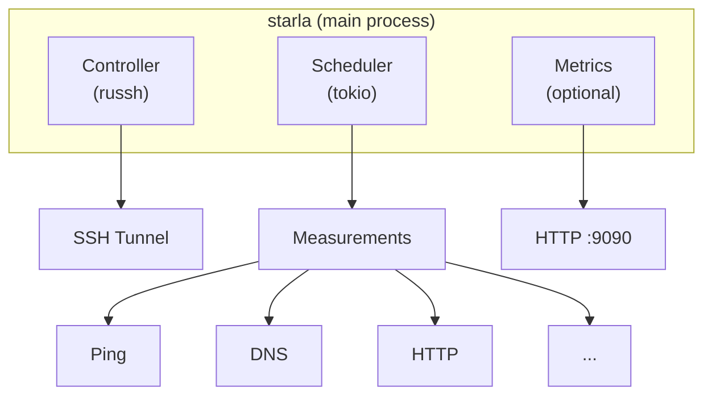

# Starla

[](LICENSE)

Starla is a network measurement probe tool that runs on end-user machines and talks
to [RIPE Atlas](https://atlas.ripe.net).
Its a drop-in replacement for the [RIPE Atlas Software Probe](https://atlas.ripe.net/docs/howtos/software-probes/).

## Features

- **All Measurement Types**: Ping, Traceroute, DNS, HTTP/HTTPS, TLS/SSL, NTP
- **Pure Rust SSH**: No OpenSSH dependency, using `russh`
- **Observability**:
  - Prometheus metrics export (optional)
  - Structured JSON logging (optional)
- **RocksDB**: Persistent measurement history
- **Feature Flags**: Minimal builds for embedded systems

## Quick Start

### Using Nix (Recommended)

```bash
# Install Nix (if not already installed)
sh <(curl -L https://nixos.org/nix/install) --daemon

# Clone and enter the development shell
git clone https://github.com/ananthb/starla
cd starla
nix develop

# Build and run
cargo build --all-features
cargo run --bin starla
```

**With direnv (automatic environment loading):**
```bash
nix profile install nixpkgs#direnv
echo 'eval "$(direnv hook bash)"' >> ~/.bashrc  # or ~/.zshrc
direnv allow
# Environment auto-loads when you cd into the directory!
```

### Using Cargo Directly

If you prefer not to use Nix, you can use cargo directly, but you'll need to manually install dependencies:

```bash
# Install Rust
curl --proto '=https' --tlsv1.2 -sSf https://sh.rustup.rs | sh

# Build with all features
cargo build --release --all-features

# Run the probe
./target/release/starla --log-dir /var/log/starla
```

## Architecture



## Building

### Using Nix

```bash
# Enter the development shell
nix develop

# Build with all features
cargo build --all-features

# Build optimized release
cargo build --release --all-features

# Build minimal (no observability)
cargo build --release --no-default-features --features minimal

# Build using nix (produces result symlink)
nix build              # default package
nix build .#minimal    # minimal package
```

### Cross-Compilation

```bash
# Cross-compile for ARM64
cargo build --release --target aarch64-unknown-linux-gnu

# Cross-compile for ARMv7
cargo build --release --target armv7-unknown-linux-gnueabihf
```

## Observability

### Prometheus Metrics

When built with `metrics-export` feature:

```bash
# Access metrics
curl http://localhost:9090/metrics

# Health check
curl http://localhost:9090/health
```

### Logging

```bash
# Default: stdout (journalctl-friendly)
starla

# View logs with journalctl
journalctl -u starla -f

# Custom log directory
starla --log-dir /var/log/starla

# Set log level
RUST_LOG=debug starla
```

## Testing

```bash
# Run all tests
cargo test --workspace --all-features

# Run tests for minimal build
cargo test --workspace --no-default-features --features minimal

# Run integration tests only
cargo test --test '*' --all-features

# Run mock controller tests
cargo test --package mock-controller --all-features

# Code coverage
cargo tarpaulin --all-features --out Html
```

## Development

### Nix Development Environment

We use a Nix flake for a fully reproducible development environment:

```bash
# Enter the development shell
nix develop

# Or with direnv (auto-loads when entering directory)
direnv allow
```

The dev shell includes:
- Rust toolchain with clippy, rustfmt, rust-analyzer
- Cross-compilation targets (x86_64, aarch64, armv7)
- Development tools (cargo-watch, cargo-tarpaulin, cargo-audit)
- Database tools (sqlite)
- Documentation tools (mdbook, graphviz)

### Common Commands

**Building:**
```bash
cargo build --all-features              # Build all crates
cargo build --release --all-features    # Release build
cargo build --no-default-features --features minimal  # Minimal build
```

**Testing:**
```bash
cargo test --workspace --all-features   # All tests
cargo test --test '*' --all-features    # Integration tests only
```

**Code Quality:**
```bash
cargo fmt --all                         # Format code
cargo fmt --all -- --check              # Check formatting
cargo clippy --all-features -- -D warnings  # Lints
cargo audit                             # Security audit
```

**Running:**
```bash
cargo run --bin starla                  # Run the probe
RUST_LOG=debug cargo run --bin starla   # With debug logging
cargo watch -x check -x test            # Auto-rebuild on changes
```

### CI/CD

- **Garnix**: Builds packages, runs checks, provides binary cache
- **GitHub Actions**: Creates releases on version tags, publishes to crates.io

```bash
# Run checks locally (same as CI)
nix flake check

# Create a release
git tag v6000.0.0
git push origin v6000.0.0
```

## License

Licensed under the AGPL v3 - See [LICENSE](LICENSE) file for full license text.

## Acknowledgments

Based on the original [RIPE Atlas Software Probe](https://github.com/RIPE-NCC/ripe-atlas-software-probe) (C implementation).
